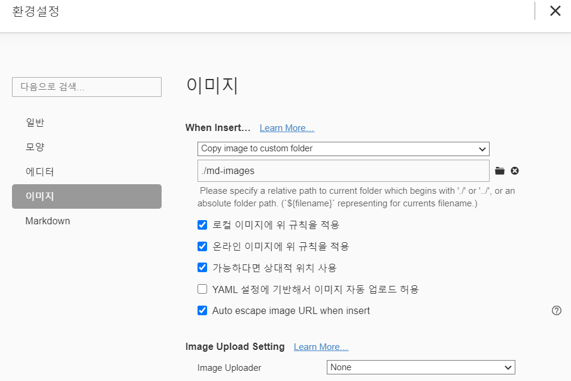

# 마크다운 활용법

## 제목(heading)

제목은 #을 통해 레벨을 지정한다.

### h3

#### h4

##### h5

###### h6

## 목록

* 순서가 없는 목록 (*사용해서)
* 순서가 없어요 
  * tab으로 하위로
  * 엔터하면 계속 쓸수 있움
* shift + tab으로 상위로

shift + tab으로 상위로

1. 순서가 있는 목록
2. 두번째 순서
   1. tab으로 하위 목록
3. shift+tab으로 상위 목록

## 코드블록

숫자 1옆에 기호 3번 입력 후 엔터 (```java)

```java
int j = 10;
double dj = 10.0;
//주석
while(True){
    //
    	//
    		//
}
```

```html
<h1>
    안녕하세요
</h1>
<!--주석-->

```

`//` 은 주석을 작성할 때 사용합니다.


## 링크

[구글](https://google.com)

## 표

| 순번 | 이름   | 비고 |
| ---- | ------ | ---- |
| 1    | 홍길동 |      |
| 2    | 김철수 |      |
| 3    | 이영희 |      |

## 이미지


내 개인 폴더 속 사진 


환경설정 통해 md-images 폴더로 이미지 복사해서 붙인것

* 가능하다면 상대경로로 

 


## 기타

*기울임(이탤릭)* **

**볼드체** ****

~~취소선~~ 물결두개

> 인용문 등 > 띄어쓰기

​	`<br/> ` 사용해서 줄바꿈 가능 