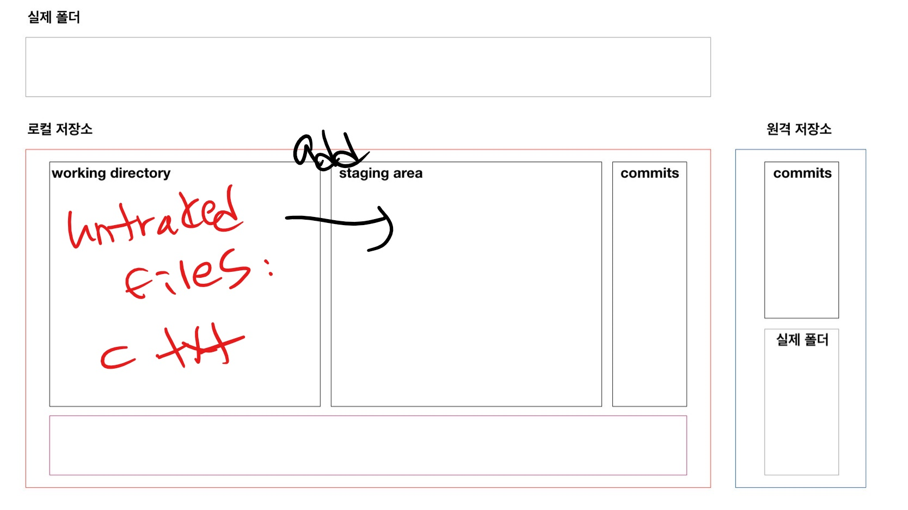
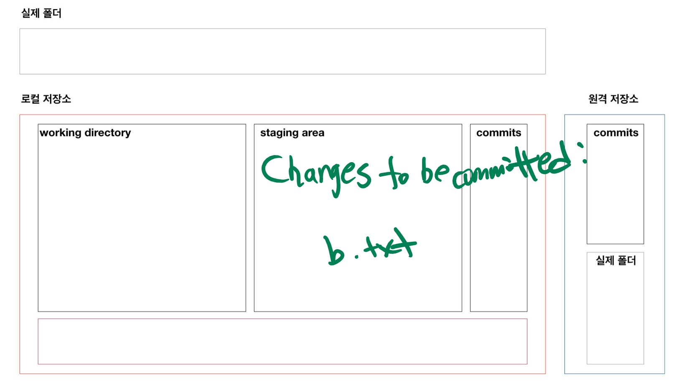

# git 기초

> 분산버전관리시스템(DVCS)

* **working directory** --`add`--> **staging area** --`commit`--> **commits**

  add



​	commit	



## 로컬 저장소(repository) 설정

```bash
$ git init
Initialized empty Git repository in C:/Users/parksoyeon/Desktop/git정리/.git/

(master)  $

```

* `.git` 폴더가 생성되고, 여기에 git과 관련된 모든 정보들이 저장된다. 

## 기본 작업 흐름

모든 작업은 `touch` 명령어를 통해서 파일을 만드는 것으로 대체 

### 1. `add`

```bash
$ git add __디렉토리__
$ git add a.txt # 특정 파일
$ git add my_folder/ # 특정 폴더
$ git add a.txt b.txt # 특정 파일들
$ git add . # 현재 디렉토리(하위 디렉토리 포함)
```

* 커밋 대상 파일 목록에 추가한다.
  * working directory의 변경사항(첫번째통)을 staging area(두번째통) 상태로 변경시킨다.

#### add 이전

```bash
$ touch new.txt
$ git status
On branch master

No commits yet 
# tracking X 파일들
#git으로 관리된 적이 없는 파일(새로 만든 파일 등)
Untracked files:
  # 커밋이 될 것에 포함시키기 위해서는 git add 명령어를 사용..
  # => 두번째통(staging area)에 담기 위해서..
  (use "git add <file>..." to include in what will be committed)
  # 파일 목록
        new.txt

# 커밋될 것에 추가된 것이 없다. staging area에는 없고, (sa X)
# working directory에는 있다. (wd O)
nothing added to commit but untracked files present (use "git add" to track)

```

#### add 이후

```bash
$ git add .
$ git status
On branch master

No commits yet
# 변경사항들.. 커밋될
# Staging area O
Changes to be committed:
  (use "git rm --cached <file>..." to unstage)
        new file:   new.txt

```

### 2. `commit`

 ```bash
$ git commit -m 'Add new.txt'
[master (root-commit) 212b127] Add new.txt
 1 file changed, 0 insertions(+), 0 deletions(-)
 create mode 100644 new.txt
 ```

* `commit` 지금 파일 상태를 스냅샷
* 커밋 메시지는 코드 변경사항(이력/버전/커밋)을 충분히 잘 나타낼 수 있도록 작성한다. 
* 아래의 명령어를 통해서 지금까지 기록된 커밋을 확인할 수 있다.

#### log

```bash
$ git log
commit 212b12774545a5184bd967e7f6f00378a59ee9b6 (HEAD -> master)
Author: soyeon <3937839p@gmail.com>
Date:   Tue Mar 16 15:07:57 2021 +0900

    Add new.txt

$ git log --oneline
212b127 (HEAD -> master) Add new.txt

$ git log -1 # 갯수
$ git log --oneline -1
```

