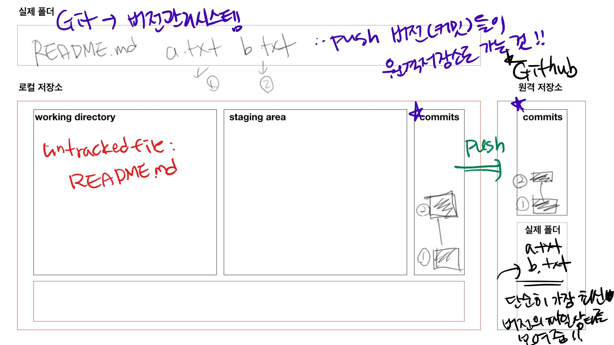

# 원격저장소 기초 활용

## 준비

* github에 비어있는 저장소(repository) 만든다.

## 기본 명령어

### 원격저장소 설정

```bash
$ git remote add origin __url__
#예시
$ git remote add origin https://github.com/soyeon0109/first.git
```

* 깃, 원격저장소(remote) 추가해줘(add) 오리진이라는 이름으로(origin) URL!
* 설정된 원격저장소를 확인하기 위해서는 아래의 명령어를 활용한다.

```bash
$ git remote -v
origin  https://github.com/soyeon0109/first.git (fetch)
origin  https://github.com/soyeon0109/first.git (push)
```

## `push`

```bash
$ git push origin master
Enumerating objects: 3, done.
Counting objects: 100% (3/3), done.
Delta compression using up to 4 threads
Compressing objects: 100% (2/2), done.
Writing objects: 100% (2/2), 231 bytes | 77.00 KiB/s, done.
Total 2 (delta 1), reused 0 (delta 0), pack-reused 0
remote: Resolving deltas: 100% (1/1), completed with 1 local object.
To https://github.com/soyeon0109/first.git
   dfd57ac..c582e01  master -> master
```

* origin 원격저장소로 push

