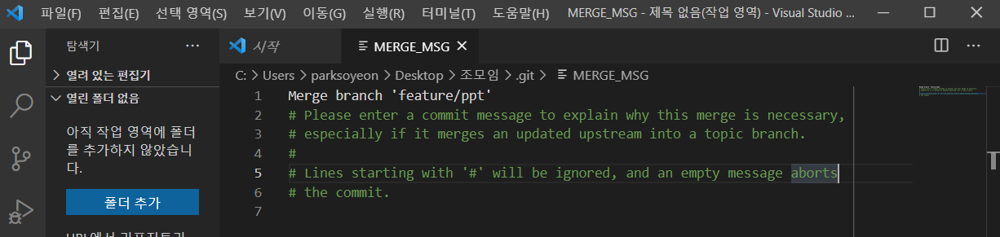
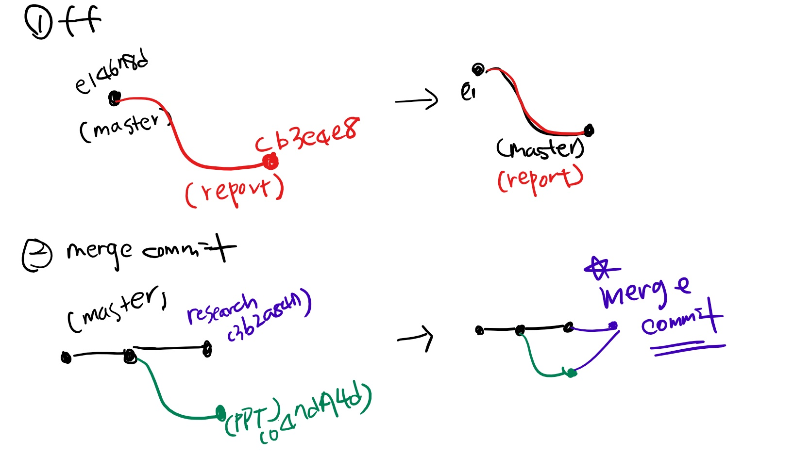

## 준비

> Git 저장소와 루트 커밋 발생

* 조모임 폴더를 만들고
* 비어 있는 README.md 파일을 만들어서
* 커밋!

### 상황 1. fast-foward

> fast-foward는 feature 브랜치 생성된 이후 master 브랜치에 변경 사항이 없는 상황

1. feature/report branch 생성 및 이동

   ```bash
   (master) $ git branch feature/report
   
   (master) $ git branch
     feature/report
   * master
   
   (master) $ git checkout feature/report
   Switched to branch 'feature/report'
   (feature/report) $
   ```

2. 작업 완료 후 commit

   ```bash
   $ touch report.txt
   
   $ git add .
   
   $ git commit -m 'Complete report'
   [feature/report 352065c] Complete report
    1 file changed, 0 insertions(+), 0 deletions(-)
    create mode 100644 report.txt
   ```
   
   ```bash
   $ git log --oneline
   352065c (HEAD -> feature/report) Complete report
   e81c2b4 (master) README.md commit
   ```


3. master 이동

   ```bash
   $ git checkout master
   Switched to branch 'master'
   ```


4. master에 병합

   ```bash
   $ git log --oneline
   e81c2b4 (HEAD -> master) README.md commit
   
   $ git merge feature/report
   Updating e81c2b4..352065c
   Fast-forward
    report.txt | 0
    1 file changed, 0 insertions(+), 0 deletions(-)
   create mode 100644 report.txt
   ```


5. 결과 -> fast-foward (단순히 HEAD를 이동)

   ```bash
   $ git log --oneline
   352065c (HEAD -> master, feature/report) Complete report
   e81c2b4 README.md commit
   ```

6. branch 삭제

   ```bash
   $ git branch -d feature/report
   Deleted branch feature/report (was 352065c).
   ```

---

### 상황 2. merge commit

> 서로 다른 이력(commit)을 병합(merge)하는 과정에서 다른 파일이 수정되어 있는 상황
>
> git이 auto merging을 진행하고, commit이 발생된다.

1. feature/ppt branch 생성 및 이동

   ```bash
   $ git checkout -b feature/ppt
   Switched to a new branch 'feature/ppt'
   ```

2. 작업 완료 후 commit

   ```bash
   $ touch ppt.pptx
   $ git add .
   $ git commit -m 'Complete ppt'
   [feature/ppt 02630b3] Complete ppt
    1 file changed, 0 insertions(+), 0 deletions(-)
    create mode 100644 ppt.pptx
   $ git log --oneline
   02630b3 (HEAD -> feature/ppt) Complete ppt
   352065c (master) Complete report
   e81c2b4 README.md commit
   ```

3. master 이동

   ```bash
   $ git checkout master
   Switched to branch 'master'
   ```

4. *master에 추가 commit 이 발생시키기!!*

   * **다른 파일을 수정 혹은 생성하세요!**

   ```bash
   $ touch research.txt
   $ git add .
   $ git commit -m 'Complete research'
   $ git log --oneline
   d3460a2 (HEAD -> master) Complete research
   352065c Complete report
   e81c2b4 README.md commit
   ```

5. master에 병합

   ```bash
   $ git merge feature/ppt
   Merge made by the 'recursive' strategy.
    ppt.pptx | 0
    1 file changed, 0 insertions(+), 0 deletions(-)
    create mode 100644 ppt.pptx
   ```

6. 결과 -> 자동으로 *merge commit 발생*

   * vim 편집기 화면이 나타납니다. 혹은 vs code

      

   * 자동으로 작성된 커밋 메시지를 확인하고, `esc`를 누른 후 `:wq`를 입력하여 저장 및 종료를 합니다.
      * `w` : write
      * `q` : quit
      
   * 커밋이  확인 해봅시다.

7. 그래프 확인하기

   ```bash
   $ git log --oneline --graph
   *   2ca91d3 (HEAD -> master) Merge branch 'feature/ppt'
   |\
   | * 02630b3 (feature/ppt) Complete ppt
   * | d3460a2 Complete research
   |/
   * 352065c Complete report
   * e81c2b4 README.md commit
   
   ```

8. branch 삭제

   ```bash
   $ git branch -d feature/ppt
   Deleted branch feature/ppt (was 02630b3).
   ```
   
   

---

### 상황 3. merge commit 충돌

> 서로 다른 이력(commit)을 병합(merge)하는 과정에서 동일 파일이 수정되어 있는 상황
>
> git이 auto merging을 하지 못하고, 해당 파일의 위치에 라벨링을 해준다.
>
> 원하는 형태의 코드로 직접 수정을 하고 merge commit을 발생 시켜야 한다.

1. feature/test branch 생성 및 이동

   ```bash
   $ git checkout -b feature/test
   Switched to a new branch 'feature/test'
   ```

2. 작업 완료 후 commit

   ```bash
   # README 수정 후 
   $ touch test.txt
   $ git status
   On branch feature/test
   Changes not staged for commit:
     (use "git add <file>..." to update what will be committed)
     (use "git restore <file>..." to discard changes in working directory)
           modified:   README.md
   
   Untracked files:
     (use "git add <file>..." to include in what will be committed)
           test.txt
   
   no changes added to commit (use "git add" and/or "git commit -a")
   ```
   
   ```bash
   $ git add .
   $ git commit -m 'Update README & Complete test'
   ```


3. master 이동

   ```bash
   $ git checkout master
   Switched to branch 'master'
   ```


4. *master에 추가 commit 이 발생시키기!!*

   * **동일 파일을 수정 혹은 생성하세요!**

   ```bash
   # README 파일 수정
   $ git add .
   $ git status
   On branch master
   Changes to be committed:
     (use "git restore --staged <file>..." to unstage)
           modified:   README.md
   
   $ git commit -m 'Update README'
   [master 63c50ea] Update README
    1 file changed, 3 insertions(+)
   ```

5. master에 병합

   ```bash
   $ git merge feature/test
   # 자동 merging을 하다가
   Auto-merging README.md
   #README.md에서 충돌
   CONFLICT (content): Merge conflict in README.md
   # 실패;
   # 충돌을 고치고, 그 결과를 커밋해!
   Automatic merge failed; fix conflicts and then commit the result.
   (master|MERGING)$ 
   ```


6. 결과 -> *merge conflict발생*

   ```bash
   $ git status
   On branch master
   # 병합이 안된 내용이 있다.
   You have unmerged paths.
   # 충돌 고치고 commit해!
     (fix conflicts and run "git commit")
     (use "git merge --abort" to abort the merge)
   
   Changes to be committed:
           new file:   test.txt
   
   Unmerged paths:
     (use "git add <file>..." to mark resolution)
     # README가 동시에 수정됨!
           both modified:   README.md
   
   ```
   
   


7. 충돌 확인 및 해결 (visual code로 열어 확인 가능)

   ```<<<<<<< HEAD
   <<<<<<< HEAD	//지금 내 위치, master
   * 보고서
   =======
   * 테스트 추가
   >>>>>>> feature/test
   ```
   
   ```bash
   * 보고서
   * 테스트 추가
   ```


8. merge commit 진행

    ```bash
    $ git add .
    $ git status
On branch master
   # 모든 충돌이 고쳐졌다.
   # merge를 끝내려면 커밋해
   All conflicts fixed but you are still merging.
     (use "git commit" to conclude merge)
   
   Changes to be committed:
           modified:   README.md
           new file:   test.txt
           
   $ git commit
   [master 47e0a59] Merge branch 'feature/test'
   ```
   
   * vim 편집기 화면이 나타납니다.
   
   * 자동으로 작성된 커밋 메시지를 확인하고, `esc`를 누른 후 `:wq`를 입력하여 저장 및 종료를 합니다.
      * `w` : write
      * `q` : quit
      
   * 커밋이  확인 해봅시다.
   
9. 그래프 확인하기

    ```bash
   $ git log --oneline --graph
   *   47e0a59 (HEAD -> master) Merge branch 'feature/test'
   |\
   | * a353ac9 (feature/test) Update README & Complete test
   * | 63c50ea Update README
   |/
   *   2ca91d3 Merge branch 'feature/ppt'
   |\
   | * 02630b3 Complete ppt
   * | d3460a2 Complete research
   |/
   * 352065c Complete report
   * e81c2b4 README.md commit
    ```


10. branch 삭제

    ```bash
    $ git branch -d feature/test
    Deleted branch feature/test (was a353ac9).
    ```
    
    
